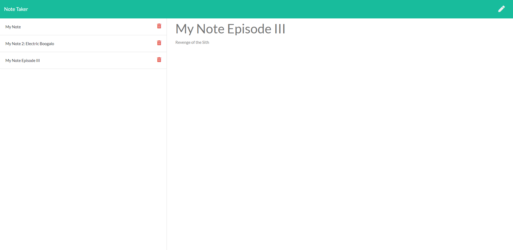

# Express Note Taker

[](https://opensource.org/licenses/MIT)

## Description

The purpose of this was to take a note taking web application with a fully built front end, and implement the back end to complete the functionality. This was completed using the express package.
  
## Table of Contents
  
- [Installation](#Installation)
- [Usage](#Usage)
- [License](#License)
- [Contributing](#Contributing)
- [Tests](#Tests)
- [Questions](#Questions)
  
## Installation

The installation of this project is as simple as having the files in this repository, and ensuring all the dependencies are installed by running the command ```npm i``` after creating you package.json either manually or by running ```npm init -y```
  
## Usage

The program can be run by typing either ```node index.js``` or ```npm start``` in the command line. It can also be accessed at the [heroku link](https://aqueous-harbor-09093.herokuapp.com/).

## Screenshot


  
## License
  
This project is licensed under [MIT](https://opensource.org/licenses/MIT)
  
## Contributing

Any contribution is welcome.
  
## Tests

Simply trying to add input via the ```/notes``` route and saving/deleting notes should be sufficient testing.
  
## Questions
  
Any further questions can be directed to me via my [GitHub](https://github.com/TopGek99/), or [email](arowe890@gmail.com) if it is a more pressing matter.
